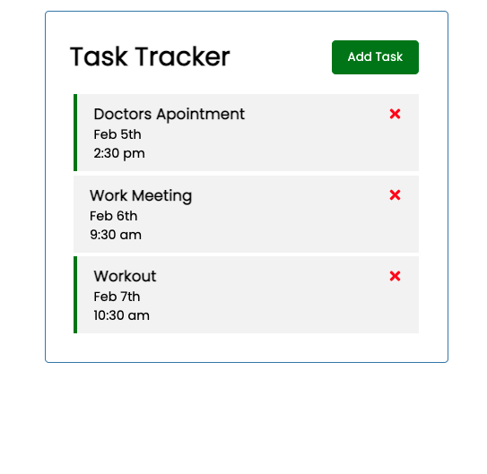
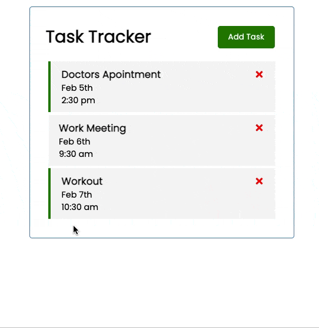
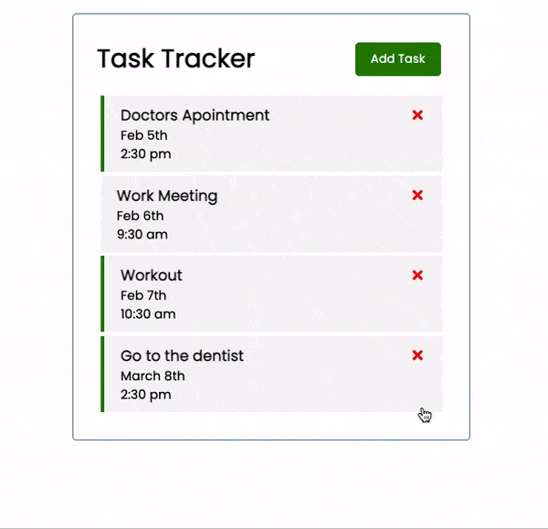
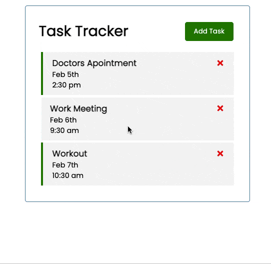

### Task List Landing Page

# Task List React Front End

This task list can be used to show how React manipulates the UI through the use of state. There is no backend for the webapp intentionally so that any changes made to the task list are a reflection of a change in the state. If you refresh the page, the original task list will appear again. 

## Table of Contents

- [Task List React Front End](#task-list-react-front-end)
  - [Table of Contents](#table-of-contents)
  - [Installation](#installation)
  - [Usage](#usage)
  - [Links](#links)
  - [Technologies](#technologies)
  - [License](#license)
  - [Contributing](#contributing)
  - [Questions](#questions)

## Installation

1. Download or clone repository
2. `npm install` to install the required npm packages to run

## Usage

- Application will be invoked by using the following command:

  `npm start`

- Open your browser and go to

  `http://localhost:3000`

- add a new task by clicking the 'Add Task' button, must contain text, click 'Close' to close the form
- click save task, the state will update to include the task
- 
- delete a task by clicking the red 'X' icon, the state will update and remove the task
- 
- double click any task in the list to toggle the reminder status (green bar on the side indicates a reminder)
- 

## Links

- [Github](https://github.com/gtscott90/task-list-react-frontend)
- [Deployed App - Coming Soon](#)

## Technologies

- React
- React Hooks
- JavaScript
- HTML
- CSS

## License

This program is free software: you can redistribute it and/or modify
it under the terms of the GNU General Public License as published by
the Free Software Foundation, either version 3 of the License, or
(at your option) any later version.
This program is distributed in the hope that it will be useful,
but WITHOUT ANY WARRANTY; without even the implied warranty of
MERCHANTABILITY or FITNESS FOR A PARTICULAR PURPOSE.See the
GNU General Public License for more details.
You should have received a copy of the GNU General Public License
along with this program. If not, see <https://www.gnu.org/licenses/>

## Contributing
@gtscott90

## Questions

Check out my other repositories in the link below:

- [GitHub Profile](https://github.com/gtscott90)

- For any additional questions, please [email](mailto:gtscott90@gmail.com) me.
